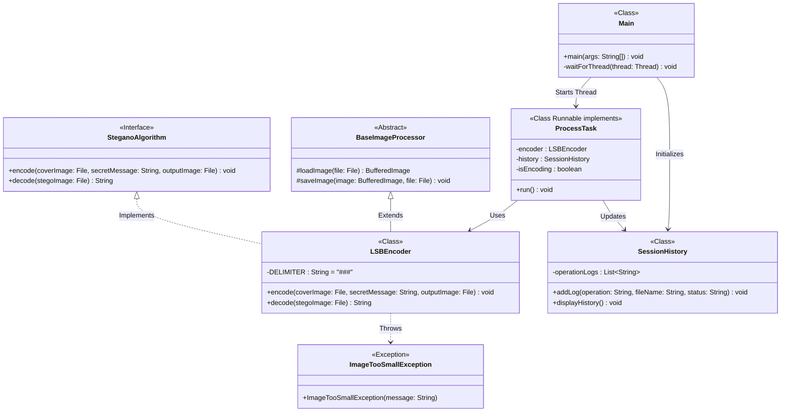

# 🔐 Digital Image Steganography for Secure Data Communication

A secure, console-based Java application that implements **Digital Image Steganography**. This tool allows users to hide confidential text messages inside standard image files without visibly altering the image, and extract them back seamlessly.

## 🚀 Key Features
* **LSB Algorithm:** Utilizes the Least Significant Bit (LSB) substitution technique for lossless data hiding in `.png` and `.bmp` files.
* **Multithreaded Processing:** Offloads heavy pixel-manipulation tasks to background threads (`Runnable`) to keep the main application responsive.
* **Modular Architecture:** Built using strict Object-Oriented Programming (OOP) principles, including Interfaces, Abstract classes, and Inheritance.
* **Robust Error Handling:** Features custom exceptions like `ImageTooSmallException` to prevent data loss or crashes during encoding.
* **Session Tracking:** Uses Java Collections to maintain a history of all encoding and decoding operations during a single runtime session.

## 🛠️ Technology Stack
* **Language:** Java (JDK 11+)
* **Libraries:** `javax.imageio.ImageIO`, `java.awt.image.BufferedImage`
* **Concepts:** OOPs, Multithreading, File I/O, Exception Handling, Collections, Bitwise Operations.

## 🧠 How it Works
The application uses the **Least Significant Bit (LSB)** technique. Digital images are made of pixels, each having a Red, Green, and Blue (RGB) value (0-255). 
The program converts your secret text into binary (0s and 1s) and replaces the very last bit (the least significant bit) of these RGB values. Because only the final bit is changed, the color variation is microscopic and completely invisible to the human eye. A custom delimiter (`###`) is appended to the message so the decoder knows exactly when to stop reading.

## 📐 System Architecture (UML Class Diagram)

