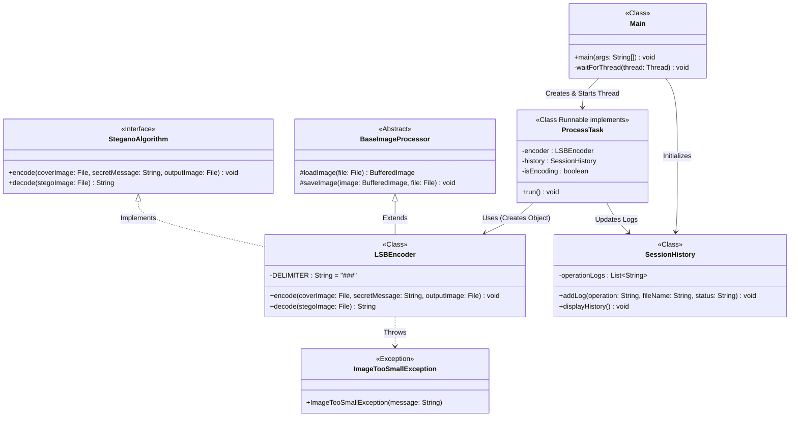

```mermaid
classDiagram
    %% INTERFACES & ABSTRACT CLASSES
    class SteganoAlgorithm {
        <<Interface>>
        +encode(coverImage: File, secretMessage: String, outputImage: File) void
        +decode(stegoImage: File) String
    }

    class BaseImageProcessor {
        <<Abstract>>
        #loadImage(file: File) BufferedImage
        #saveImage(image: BufferedImage, file: File) void
    }

    %% CORE ENGINE CLASSES
    class LSBEncoder {
        <<Class>>
        -DELIMITER : String = "###"
        +encode(coverImage: File, secretMessage: String, outputImage: File) void
        +decode(stegoImage: File) String
    }

    class ImageTooSmallException {
        <<Exception>>
        +ImageTooSmallException(message: String)
    }

    %% MODELS & THREADS
    class SessionHistory {
        <<Class>>
        -operationLogs : List~String~
        +addLog(operation: String, fileName: String, status: String) void
        +displayHistory() void
    }

    class ProcessTask {
        <<Class Runnable implements>>
        -encoder : LSBEncoder
        -history : SessionHistory
        -isEncoding : boolean
        +run() void
    }

    class Main {
        <<Class>>
        +main(args: String[]) void
        -waitForThread(thread: Thread) void
    }

    %% RELATIONSHIPS (Arrows and Connections)
    SteganoAlgorithm <|.. LSBEncoder : Implements
    BaseImageProcessor <|-- LSBEncoder : Extends
    LSBEncoder ..> ImageTooSmallException : Throws
    
    ProcessTask --> LSBEncoder : Uses (Creates Object)
    ProcessTask --> SessionHistory : Updates Logs
    Main --> ProcessTask : Creates & Starts Thread
    Main --> SessionHistory : Initializes
```
